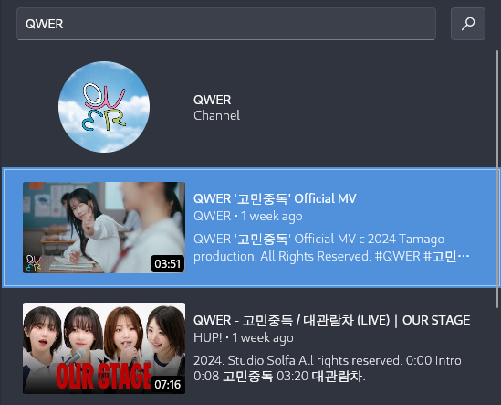

<div align="center">

<h1>Yatta ヤッタ</h1>

[](https://github.com/bdlukaa/fluent_ui "Made with Fluent Design")
[](https://discord.gg/QR63QRZntK "Discord")

<em>An on-demand videos client for searching, browsing, managing videos from your favorite on-demand video platforms.</em>
</br>

</div>

> [!WARNING]  
> This application is currently under development, changes on application behavior is expected without notice nor migration guide.

## Features

- Search videos from your favorite platform (YouTube, Peertube, etc) 🔎
- Video playlist (history, saved, etc) 🗃️
- Plain text database for easy scripting 📃
- Modal navigation for keyboard user 🇭 🇯 🇰 🇱
- Middle click autoscrolling, just like web browsers 🖱️

## Supported video platforms

- YouTube (via [YouTube Data API](https://developers.google.com/youtube/v3))

## User guide

### YouTube API key

Read the guide [here](https://developers.google.com/youtube/v3/getting-started). Once you obtain the API key, go to `Settings > YouTube API Settings > API key` and add the API key.

> [!NOTE]  
> This API key will be good daily personal usage. For detailed breakdown on how YouTube Data API quota is calculated, read [ YouTube Data API (v3) - Quota Calculator](https://developers.google.com/youtube/v3/determine_quota_cost). You can adjust how the app consume this quota in `Settings > YouTube API Settings` by disabling/limiting few features.

### Playing videos

Example below shows a guide to play video from Chromium web browser:

Go to `Setting > Video play command`, edit the command to:

```
chromium $url
```

You can also add extra command to run after the other command by pressing `Add more` button. For example you can add notification:

```
chromium $url
```

```
notify-send Playing video $title\n$description
```

Available variable to use includes:

| Name          | Description                                                  | Example                                                                                                                      |
| ------------- | ------------------------------------------------------------ | ---------------------------------------------------------------------------------------------------------------------------- |
| `url`         | -                                                            | `https://www.youtube.com/watch?v=qWNQUvIk954`                                                                                |
| `title`       | -                                                            | `Rick Astley - Never Gonna Stop (Official Video)`                                                                            |
| `description` | -                                                            | `Never Gonna Stop (Official Video) Listen here: https://rickastley.lnk.to/NeverGonnaStopID The new album 'Are We There Yet?` |
| `type`        | Object type (possible value: `video`, `channel`, `playlist`) | `video`                                                                                                                      |
| `preview`     | Large size image                                             | `https://i.ytimg.com/vi/qWNQUvIk954/hqdefault.jpg`                                                                           |
| `thumbnail`   | Medium size image                                            | `https://i.ytimg.com/vi/qWNQUvIk954/mqdefault.jpg`                                                                           |
| `icon`        | Small size image                                             | `https://i.ytimg.com/vi/qWNQUvIk954/default.jpg`                                                                             |

### Keyboard Navigation

| Key                            | Function                                          |
| ------------------------------ | ------------------------------------------------- |
| `h`, `j`, `k`, `l`             | Move right, down, up, left                        |
| `p`                            | Play video                                        |
| `o`                            | Listen video                                      |
| `ctrl` `k` / `ctrl` `l` / `F2` | Focus on search bar                               |
| `?`                            | [#21](https://github.com/brainwo/yatta/issues/21) |

### Configuring Yatta from a text editor [#20](https://github.com/brainwo/yatta/issues/20)

Looking for editing your Yatta configuration from a text editor? We got you covered.

Yatta uses [YAML](https://yaml.org/) for the configuration file. Which is compatible with JSON, meaning you can use JSON if you prefer it over YAML.

Configuration file will be read based on this prority list:

```
$XDG_CONFIG_HOME/yatta/config.yaml
$XDG_CONFIG_HOME/yatta/config.json
$HOME/.config/yatta/config.yaml
$HOME/.config/yatta/config.json
/etc/yatta/config.yaml
/etc/yatta/config.json
```

A user configuration file should be created if you changed the application configuration within the application.
If you need to make a new user configuration file, simply create a new file in `$XDG_CONFIG_HOME)/yatta/config.yaml`[\*](https://wiki.archlinux.org/title/XDG_Base_Directory).

#### (Optional) Setup your language server

Install and configure [`yaml-languague-server`](https://github.com/redhat-developer/yaml-language-server) for your editor.

Add this line to the top of your configuration file:

```yaml
# yaml-language-server: $schema=https://gist.githubusercontent.com/brainwo/7eeddb3b5ae171ed1c86c28df1ff6c01/raw/schema.json
```

#### Documentation

[#22](https://github.com/brainwo/yatta/issues/22)

## Building from source

This program is written using Flutter. For installation guide, please refer to [official Flutter's setup guide](https://docs.flutter.dev/get-started/install/linux/desktop). No additional build dependencies required beside the dependencies required by Flutter.

If you have a problem when building, check `pubspec.lock` file to find compatible Flutter SDK version to use, for example the snippet below indicating Flutter SDK version `3.19.X`:

```
sdks:
  dart: ">=3.3.0 <4.0.0"
  flutter: ">=3.19.0"
```

## Contributing

This project uses [conventional commit](https://www.conventionalcommits.org/en/v1.0.0/). [`git-cc`](https://github.com/skalt/git-cc) plugin is recommended.

<details>
<summary><strong>How do I add support for a new video platform?</strong></summary>
First please confirm the platform you are adding has an official search API support, otherwise your request will be rejected. Other than that, piracy sites will also be rejected.
</details>

## License

[GNU General Public License, version 3](./LICENSE)
